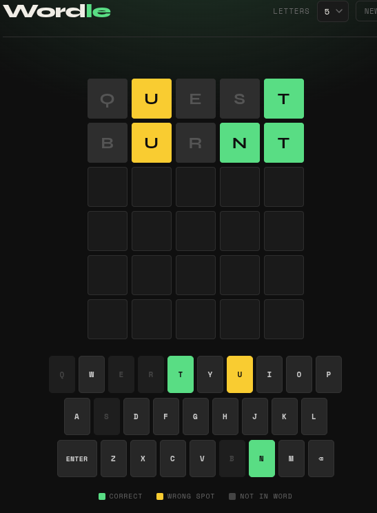
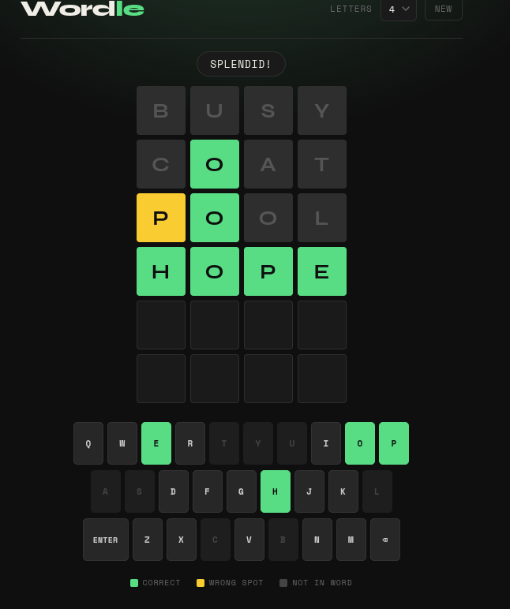

# 🟩 Wordle — Open Source

A clean, fully self-contained Wordle clone built with vanilla HTML, CSS, and JavaScript. No frameworks, no dependencies, no server required — just open the file and play.

> Built with the assistance of [Claude](https://claude.ai) by Anthropic.

---

## Screenshots

<!-- Replace the placeholders below with your own screenshots -->

| Gameplay | Win State |
|----------|-----------|
|  |  |

> 💡 **How to take screenshots:** Open `wordle.html` in your browser, play a round, and capture with `Cmd+Shift+4` (Mac) or `Win+Shift+S` (Windows). Save them to a `screenshots/` folder in the repo.

---

## Features

- 🔤 **Configurable word length** — choose between 4, 5, 6, or 7 letters
- ⌨️ **Physical & on-screen keyboard** — type or click to play
- 🎨 **Color-coded feedback** — green (correct), yellow (wrong spot), gray (not in word)
- ✨ **Smooth animations** — tile flip, pop, shake, and bounce effects
- 🌙 **Dark theme** — easy on the eyes
- 📦 **Zero dependencies** — single HTML file, works offline

---

## Getting Started

### Play instantly

Just download `wordle.html` and open it in any modern browser — Chrome, Firefox, Safari, or Edge.

```bash
git clone https://github.com/YOUR_USERNAME/wordle.git
cd wordle
open wordle.html   # macOS
# or double-click wordle.html on Windows/Linux
```

No build step. No `npm install`. Nothing.

---

## How to Play

1. Guess the hidden word in **6 attempts**
2. Type a word and press **Enter** to submit
3. Tiles change colour to guide your next guess:

| Colour | Meaning |
|--------|---------|
| 🟩 Green | Correct letter, correct position |
| 🟨 Yellow | Correct letter, wrong position |
| ⬜ Gray | Letter not in the word |

4. Use the colour hints to narrow down the word!

---

## Customisation

### Change word length
Use the dropdown in the top-right corner to switch between **4, 5, 6, or 7 letter** words. A new game starts automatically.

### Add your own words
Word lists live inside `wordle.html` in the `WORDS` object near the top of the `<script>` block:

```js
const WORDS = {
  4: ["able", "acid", ...],
  5: ["aback", "abbey", ...],
  6: ["absorb", "accent", ...],
  7: ["absence", "account", ...]
};
```

Simply add words to the relevant array. Words must be all lowercase and match the key length exactly.

### Change the number of guesses
Find this line near the top of the script and adjust the value:

```js
let wordLen = 5, maxRows = 6, ...
```

Change `maxRows` to any number you like (e.g. `8` for a harder game).

---

## Project Structure

```
wordle/
├── wordle.html       # The entire game — HTML, CSS, and JS in one file
├── LICENSE           # MIT License
├── README.md         # This file
└── screenshots/      # Add your own screenshots here
    ├── gameplay.png
    └── win.png
```

---

## Contributing

Contributions are welcome! Ideas for improvement:

- 🌍 Word lists in other languages
- 📱 Better mobile layout
- 🏆 Score tracking / streaks
- 🔗 Share results (emoji grid)
- ♿ Accessibility improvements (ARIA labels, high-contrast mode)

To contribute:

1. Fork the repo
2. Create a branch: `git checkout -b feature/my-feature`
3. Make your changes and test in a browser
4. Open a Pull Request with a clear description

Please keep the zero-dependency, single-file spirit of the project intact where possible.

---

## License

MIT © 2026 [Your Name] — see [LICENSE](LICENSE) for details.

---

## Acknowledgements

- Inspired by the original [Wordle](https://www.nytimes.com/games/wordle/index.html) by Josh Wardle
- Built with the assistance of [Claude](https://claude.ai) by [Anthropic](https://anthropic.com)
- Fonts: [Syne](https://fonts.google.com/specimen/Syne) & [Space Mono](https://fonts.google.com/specimen/Space+Mono) via Google Fonts
